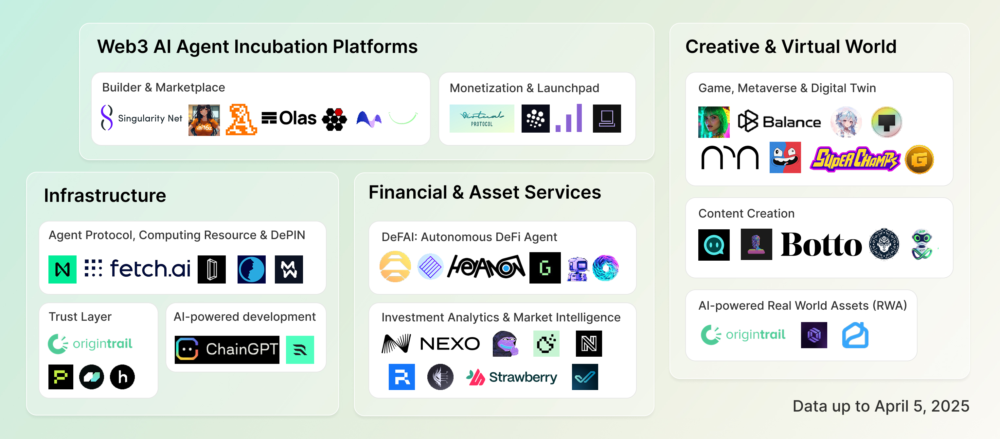

# Web3-AI Agent Artifact

**Yiming Shen<sup>1</sup>**, **Jiashuo Zhang<sup>2</sup>**, **Zhenzhe Shao<sup>1</sup>**, **Wenxuan Luo<sup>3</sup>**, **Yanlin Wang<sup>1</sup>**, **Ting Chen<sup>3</sup>**, **Zibin Zheng<sup>1</sup>**, **Jiachi Chen<sup>4</sup>**

<sup>1</sup> School of Software Engineering, Sun Yat-sen University, Zhuhai, Guangdong, China  
<sup>2</sup> School of Computer Science, Peking University, Beijing, China  
<sup>3</sup> School of Computer Science and Engineering (School of Cyber Security), University of Electronic Science and Technology of China, Chengdu, China  
<sup>4</sup> The State Key Laboratory of Blockchain and Data Security, Zhejiang University, Hangzhou, China  

This is the artifact for our paper "[Web3 × AI Agents: Landscape, Integrations, and Foundational Challenges](https://arxiv.org/abs/2508.02773)". This repository is made available under the Public Domain Dedication and License v1.0 whose full text can be found at: http://opendatacommons.org/licenses/pddl/1.0/ - see the [LICENSE](./LICENSE) file for details.

<div style="overflow: auto;">
  
</div>

## What is Web3-AI Agent?

Web3-AI Agents represent the convergence of artificial intelligence and decentralized technologies, creating intelligent autonomous systems that operate within blockchain ecosystems. These agents leverage Large Language Models (LLMs) as their core reasoning engine and function as intelligent front-ends for Web3 interactions.

**Key Applications:**
- Autonomous trading bots and DeFi portfolio managers
- Cross-chain transaction assistants and intelligent wallet interfaces  
- Smart contract auditing and vulnerability detection
- Decentralized governance participation

## What's Inside the Artifact

### A dataset of Web3-AI Agent projects: `web3-projects.xlsx`

Our comprehensive dataset contains **133 Web3-AI Agent projects** collected from three sources: [CoinMarketCap](https://coinmarketcap.com), [GitHub](https://github.com/), and [Product Hunt](https://www.producthunt.com/).

**Project Categories:**
- **AI Agent Incubation (`builder`, `launchpad`)(56)**: Builder platforms, marketplaces, and launchpads
- **Infrastructure (`infrastructure`, `trust`, `copilot`)(34)**: Agent protocols, trust layers, and development tools
- **Financial Services (`defai`, `analytics`)(55)**: DeFi agents and investment analytics
- **Creative & Virtual (`game`, `content-creation`, `digital-twin`, `rwa`)(28)**: Gaming, metaverse, and content creation


#### Data Schema

Each project entry includes the following **Data Fields:** project name, category, description, market cap, GitHub URL, project URL, whitepaper, and source.


| Field | Description |
|-------|-------------|
| **project** | Project name |
| **category** | Primary classification category |
| **description** | Detailed project description and capabilities |
| **slug** | URL-friendly on-chain project identifier (if applicable)|
| **market_cap** | Market capitalization in USD (April 2025 snapshot) |
| **address** | Blockchain contract address (if applicable) |
| **github_url** | GitHub repository URL(s) (if applicable)|
| **project_url** | Official project website |
| **white_paper** | Link to technical whitepaper (if applicable)|
| **source** | Data collection source |

> NOTE: Market capitalization data represents a snapshot captured from CoinMarketCap in April 2025. These values reflect the market conditions at the time of data collection and may not represent current market valuations due to the volatile nature of cryptocurrency markets.


## Citation

```bibtex
@article{shen2024web3ai,
  title={Web3 × AI Agents: Landscape, Integrations, and Foundational Challenges},
  author={Shen, Yiming and Zhang, Jiashuo and Shao, Zhenzhe and Luo, Wenxuan and Wang, Yanlin and Chen, Ting, Zheng Zibin and Chen, Jiachi},
  journal={arXiv preprint arXiv:2508.02773},
  year={2025}
}
```

## Contact

For questions about this artifact, please contact: [shenym7@mail2.sysu.edu.cn](mailto:shenym7@mail2.sysu.edu.cn)
